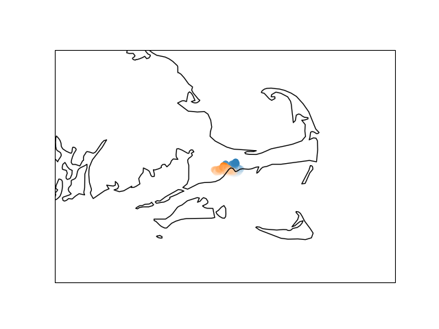

# Cartopy Basic HUD

The Cartopy python library can draw coastlines and maps in matplotlib,
so it's a good basis for plotting a heads-up display of things like 
telemetry.

## Installation/Setup

### Install GIS Libraries

My system has GEOS and PROJ, which I believe are required. 
The "[Installing Cartopy](https://scitools.org.uk/cartopy/docs/latest/installing.html)"
page has tips on how to install these in various environments. 

I have these versions:

    $ geos-config --version
    3.6.2
    $ proj
    Rel. 4.9.3, 15 August 2016
    usage: proj [ -bCeEfiIlormsStTvVwW [args] ] [ +opts[=arg] ] [ files ]

### Install Python Software

1. Create a python virtual environment. I'm using Python 3.6.9 (64-bit).
2. Install most of the requirements:

        $ pip install requirements.txt
        
3. Install Cartopy:

        $ pip install requirements_cartopy.txt
        
   (Cartopy requires that Numpy already be installed, so installing Cartopy is a separate step.) 
  
4. Install this package:

       $ pip install -e .
       
   The `-e` flag tells pip to reference these files rather than copying them, so that 
   changes will be reflected without having to reinstall this package.
  
## Running 

    $ cartopy_hud --tracks 2
    
 
 